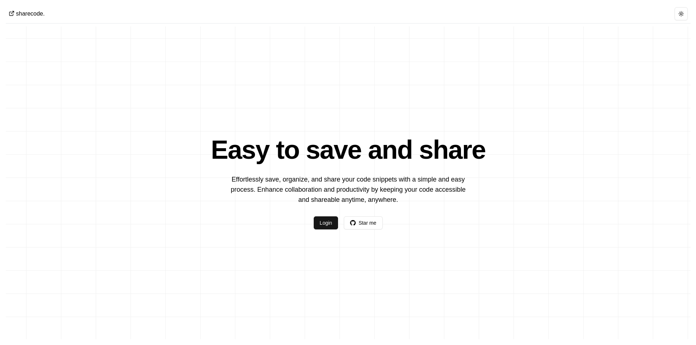
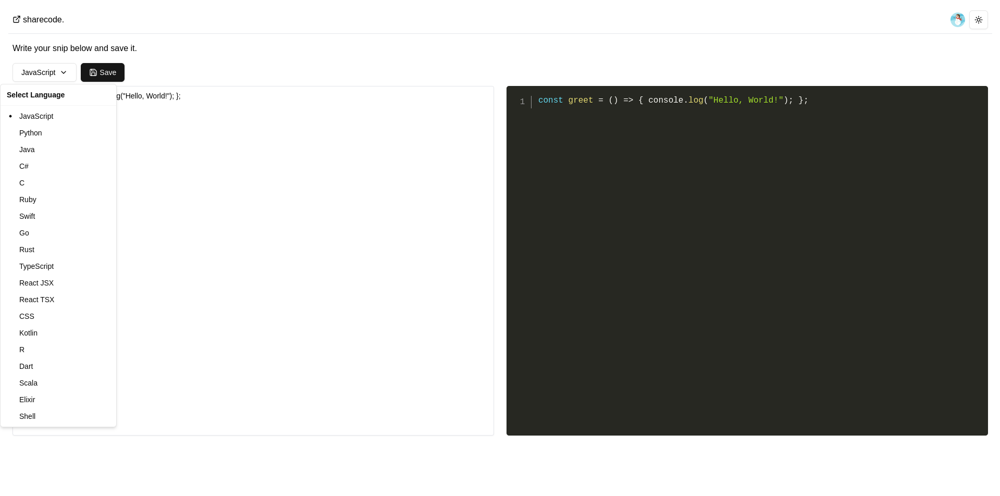
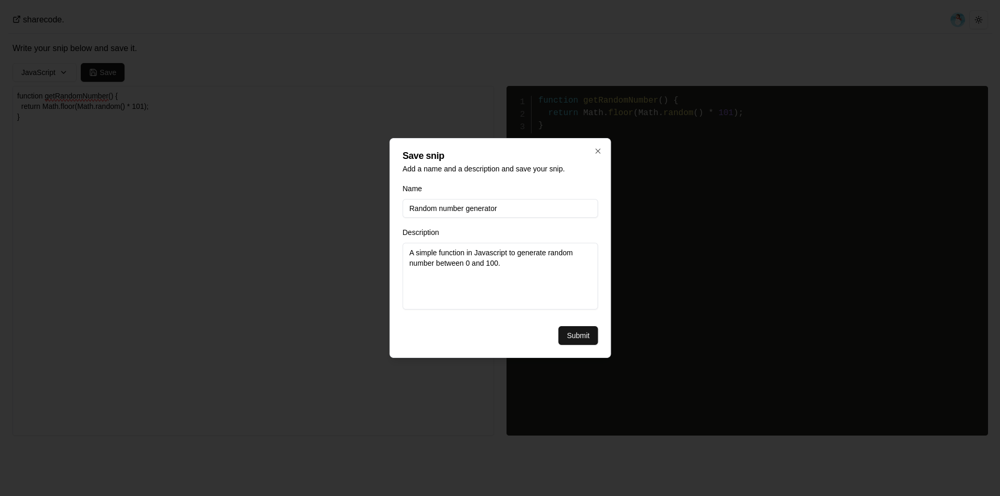
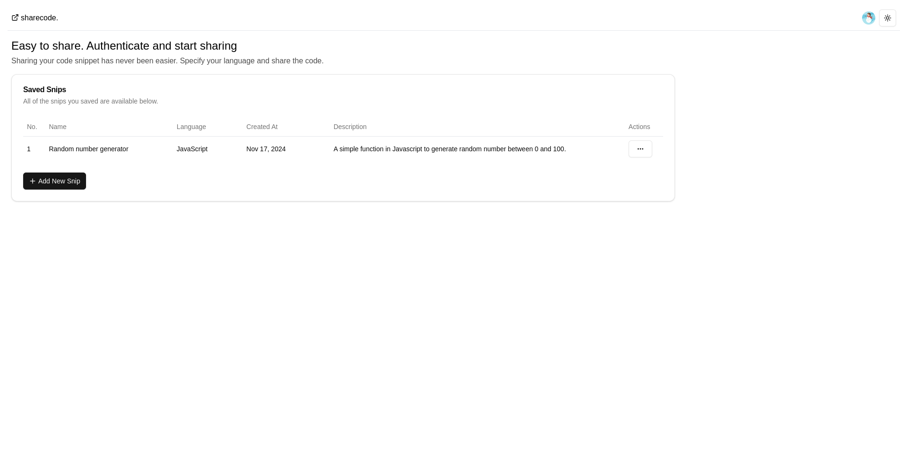
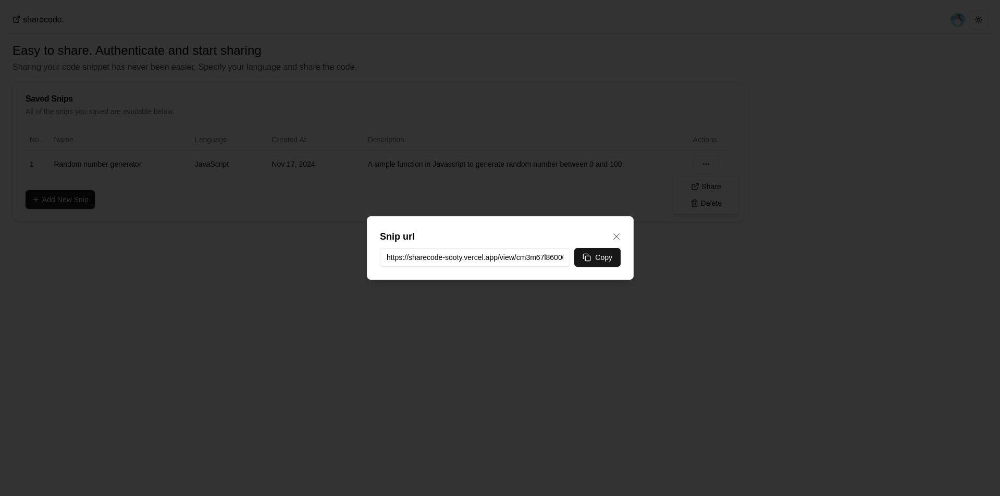

# ShareCode

**ShareCode** is a simple and efficient code-sharing tool designed to make sharing and organizing code snippets easy. With support for multiple programming languages, ShareCode offers a user-friendly interface to create, store, and share your favorite snippets.

## Features

- **Multi-language Support**: Share snippets in languages like JavaScript, Python, Java, C++, Go, Rust, and more.
- **Organized Storage**: Categorize snippets with descriptions for quick reference.
- **Clean Interface**: A simple, intuitive UI for seamless usage.
- **Authentication**: Secure your snippets with user accounts powered by Clerk.

## Tech Stack

- **Frontend and Backend**: Next.js 14 with server actions
- **Authentication**: Clerk
- **Database**: PostgreSQL with Supabase
- **ORM**: Prisma
- **UI**: Tailwind and ShadCN

## Installation

1. Clone the repository:

   ```bash
   git clone https://github.com/yourusername/sharecode.git
   cd sharecode
   ```

2. Install dependencies:

   ```bash
   npm install
   ```

3. Set up environment variables:

- Create a .env file in the root directory.
- Add variables from the example.env file

4. Run the development server:

   ```bash
   npm run dev
   ```

5. Open http://localhost:3000 in your browser to view the application.

## License

This project is licensed under the MIT License.

## Screenshots






